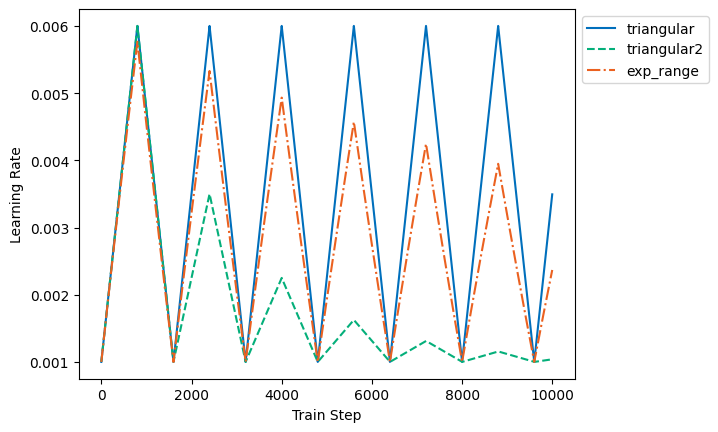

# CyclicalLearningRateSchedule
Implemented TensorFlow version of [Smith's "Cyclical learning rates for training neural networks" (2017)](https://arxiv.org/pdf/1506.01186.pdf?utm_medium=Exinfluencer&utm_source=Exinfluencer&utm_content=000026UJ&utm_term=10006555&utm_id=NA-SkillsNetwork-Channel-cvstudio-2021-01-01).

